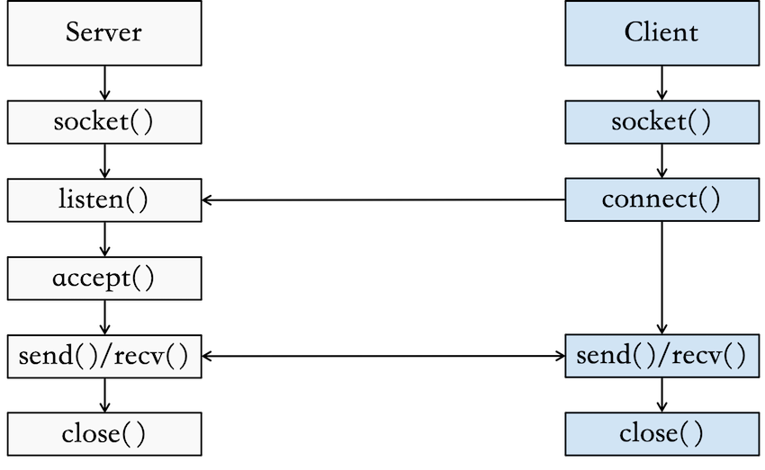

# MessengerFX 
> A dark theme chatroom application.

## Requirements
This code was tested with Java 12.0.0 and JavaFX 11.0.2.

## Login Interface


## Chatroom Interface


## Multi-user Supported


## Direct Message


## Logout Interface


## Flowchart
<p align="center">
  
</p>

## Settings
The default IP is `127.0.0.1` and the default port is `6666`.

## Run MessengerFX
`server.jar` and `client.jar` are provided for users who do not want to build the project.

Clone the repository:
```shell
git clone https://github.com/void-jw/MessengerFX.git
```

To run server.jar:
```shell
java --module-path {PATH_TO_JAVAFX}/javafx-sdk-11.0.2/lib --add-modules javafx.controls,javafx.fxml -jar ./jar/server.jar
```

To run client.jar:
```shell
java --module-path {PATH_TO_JAVAFX}/javafx-sdk-11.0.2/lib --add-modules javafx.controls,javafx.fxml -jar ./jar/client.jar
```

**Please note that the `server.jar` must be executed before `client.jar` is executed in order to get connection**  

## Manipulation
`Enter` for login or send message, while `Escape` for logout or shutdown program.

To DM somebody, please type:
```
/msg {User Name}: message
```

## Implementation
The project is implemented using socket programming.


<p align="center">
  
</p>

Find out more at [Java Socket](https://docs.oracle.com/javase/7/docs/api/java/net/Socket.html).

